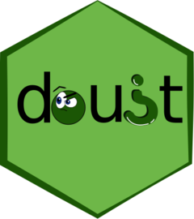

# doubt 

[](https://travis-ci.org/moodymudskipper/doubt)
[](https://codecov.io/gh/moodymudskipper/doubt?branch=master)

```{r, include = FALSE}
knitr::opts_chunk$set(
  collapse = TRUE,
  comment = "#>",
  fig.path = "man/figures/README-",
  out.width = "100%"
)
```

## Overview

*doubt* overrides the operator `?` to provide:

* **dubious operators** : Unary and binary operators from existing functions straight out of the box
* **dubious pipes** : Piping operators of different precedences
* **dubious syntaxes** :  Flexible n-ary operators

The standard usages `?topic` and `type?topic`
as documented in `help("Question")` still work.

We refer to all of those as "dubious", both as a reference to the 
package name and to emphasize the fact that they're not parsed as proper operators.

The syntax that doubts uses is quirky and will be very surprising to many, and
possibly blasphemous to some. I don't expect to see many people sharing code 
that would use doubt, but it can be convenient for interactive use, personal
projects or specific uses that justify designing a DSL.

It also lives as a style exercise of metaprogramming pushed to the extreme.

### Installation

Install with :

``` r
remotes::install_github("moodymudskipper/doubt")
```

### Dubious operators

R provides some `%foo%` infix operators such as `%in%`, or `%/%`, their
precedence is between `^` and `*`.

Once the package *doubt* is attached, any accessible function can be called as
such operators : 

```{r}
library(doubt, warn.conflicts = FALSE)
1:4 %%head? 2 + 1 # same precedence as standard infix operators
```

I we needed an infix operator with a different precedence we could also use
`^head?`, `-head?` etc, and the precedence would be given by the first symbol
of the operator. 

In practice the syntax `%%fun?` will generally be more useful,
but sometimes `~fun?` can be helpful due to its low precedence, for instance
`x + y ~saveRDS? file` will save `x + y` where `x + y %%saveRDS? file` would have
saved `y`.

Unary operators can be used too, which is nice for interactive use as we spare
some parentheses. Unary operators are `+`, `-`, `!` or `~`.  Generally
`~` will be more adaped due to its low precedence but `+` is less visually
confusing as unary `+` is rarely used in practice.

```{r}
~head? 1:10
```

It's possible to pass more arguments by using `{}` on the rhs, this works with
both unary and binary forms and is interesting in that arguments are separated
by new lines (or `;`), and not by commas, which can be handy in situations where
commas can add confusions, such as benchmarks, R6 definitions, or shiny UI functions.

```{r}
"a" +paste? "b"
+paste?{"a"; "b"}
"a" +paste?{"b"; "c"}
```

```{r, eval = FALSE}
library(microbenchmark)
+microbenchmark?{
  a= sapply(iris, length)
  b= lengths(iris)
}

library(shiny)
cat(as.character(
  +fluidPage?{
    title = "Hello Shiny!"
    +fluidRow?{
      +column?{
        width = 4
        "4"
      }
      +column?{
        width = 3
        offset = 2
        "3 offset 2"
      }
    }
  }
))

library(R6)
# example borrowed from https://adv-r.hadley.nz/r6.html and modified 
R6Class("Person", +list?{
  name = NULL
  age = NA
  initialize = function(name, age = NA) {
    self$name <- name
    self$age <- age
  }
})
```

## Dubious pipes

Dubious pipes are similar to *magrittr*'s pipes, except we can choose their precedence.

Piping with another precedence is useful when working interactively to avoid
editing brackets in many places. A common use case is to avoid brackets
when calling `plotly::ggplotly()` on a `ggplot` object. The calls below are 
indeed equivalent :

```{r, eval = FALSE}
library(ggplot2)
library(plotly)
library(magrittr)
# standard use
ggplotly(ggplot(cars, aes(speed, dist)) + geom_point())
(ggplot(cars, aes(speed, dist)) + geom_point()) %>% ggplotly()
# using doubt
ggplot(cars, aes(speed, dist)) + geom_point() ~.? ggplotly(.)
```

### Dubious syntaxes

*doubt* supports the definition of complex syntaxes with very low effort.
This is better understood by an example, let's build a silly function that adds
2 numbers.

```{r}
"?add: ({x})({y})" <- "{x} + {y}"
?add: (2)(3)
```

We see that the name of the created object contains a glue-like pattern (see package
*glue* from Jim Hester), then value of the object is another glue like string which
describes the actual code to execute.

More practical now, say I want to easily `View()`
the output of an call, but can't be bother to wrap it in `View()`,
I just want to type "?v" at the end of the call:

```{r, eval = FALSE}
"{expr}?v" <- "View({expr})"
head(cars) ?v # same as View(head(cars))
```

For it to work the `?` symbol should either be used in its unary form at the 
start of the expression as in the former case, or in its binary form anywhere else outside of
`()`, `{}` and control flows. And of course, the expression should be syntactic.

Other examples, let's design an alternative `for` loop :
 
```{r}
"?FOR? {x} = {from} :step: {by} :to: {to} :do: {expr}" <- 
  "for({x} in seq({from}, {to}, {by})) {expr}"
?FOR? z = 3 :step: 2 :to: 10 :do: print(z*10) 
```

Or a python style function definition :

```{r}
"def?{nm}({args}):{expr}" <- "{nm} <- function({args}) {expr}"
# test it to define a simple function
def? area(length=10, width=10):{length * width}
area(2)
area(3,4)
```

### Registering a dubious syntax in a package

To be recognized by *doubt* a dubious syntax must either :

* be defined in the global environment
* be defined in a package AND registered

To define dubious syntaxes in your package should import *doubt*, which you can
do by running `devtools::use_package("doubt")`, then I suggest you store them
in a script following this template (if you use *roxygen2*): 


```{r, eval = FALSE}
#' Modified question mark operator
#'
#' Reexported from package *doubt*
#' @inheritParams doubt::`?`
#' @export
`?` <- doubt::`?`

.onAttach <- function(libname, pkgname) {
  doubt::register_dubious_syntaxes(c("?add: ({x})({y})", "{expr}?v"))
  invisible()
}

#' dubious syntaxes
#'
#' @name dubious
NULL

#' @export
#' @rdname dubious
#' @usage add: (x)(y)
#' @examples
#' ?add: (1)(2)
"?add: ({x})({y})" <- "{x} + {y}"

#' @export
#' @rdname dubious
#' @usage expr?v
"{expr}?v" <- "View({expr})"
```

In this example, we document on the same page both syntaxes. Note that they must
be registered in the definition of `.onAttach()`.
